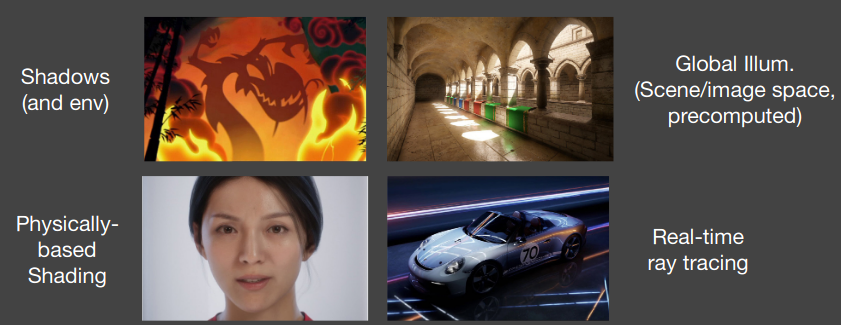
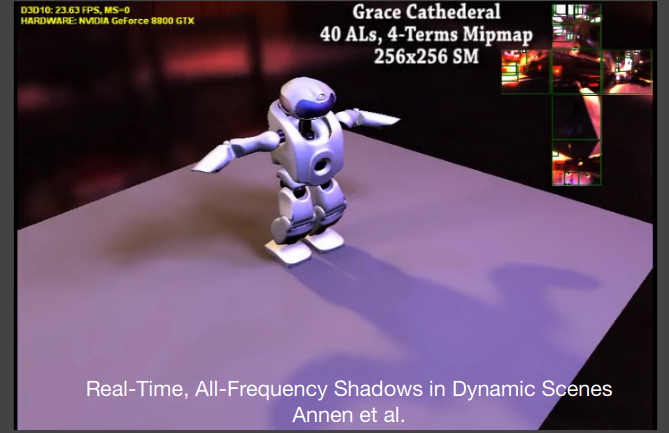
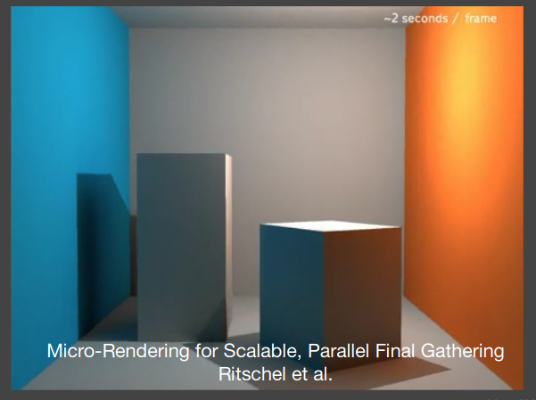
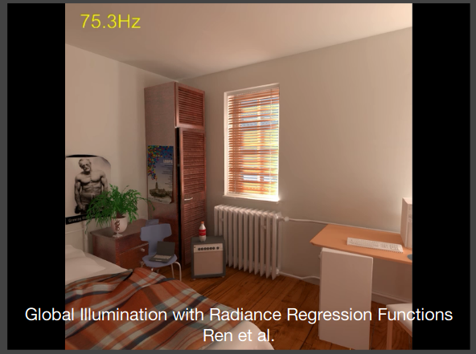
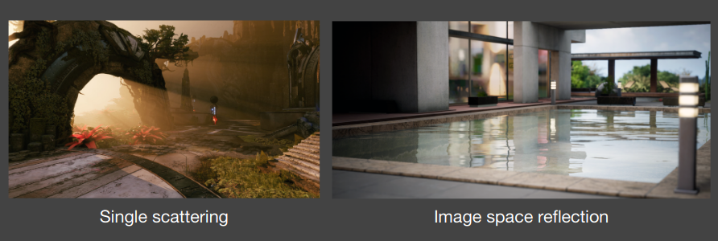
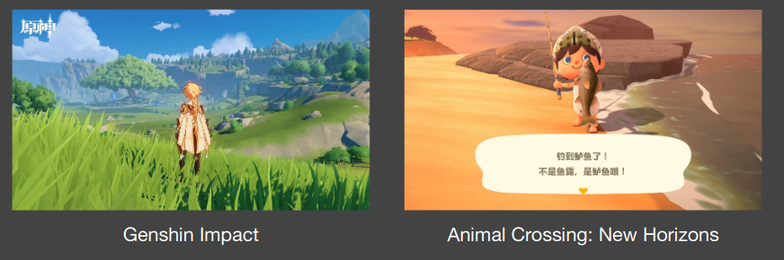

# Real-Time_High_Quality_Rendering
It's a notebook of Real-Time High Quality Rendering (GAMES 202) by Lingqi Yan 2021


Class website: https://sites.cs.ucsb.edu/~lingqi/teaching/games202.html

## Overview

### What is Real-Time High Quality Rendering about?

- Real-Time

  - Speed: more than 30 FPS (frames per second), even more for Virtual / Augmented Reality (VR / AR): 90 FPS
  - Interactivity: Each frame generated on the fly

- High Quality

  - Realism: advanced approaches to make rendering more realistic
  - Dependability: all-time correctness (exact or approximate), no tolerance to (uncontrollable) failures

- Rendering

  - ```mermaid
    graph LR
    1["3D scene (meshes, lights, etc)"]  --> 2[Calculating<br>light->eye]-->3[Image]
    ```

- Highest level: 4 different parts on real-time rendering
  - Shadows (and env)
  - Global Illum. (Scene/image space, precomputed)
  - Physically-based Shading
  - Real-time rag tracing



### Course Topics

- Shadow and Environment Mapping

  

- Interactive Global Illumination Techniques

  

- Precomputed Radiance Transfer

  

- Real-Time Ray Tracing

- Participating Media Rendering, Image Space Effects, etc.

  

- Non-Photorealistic Rendering

  - But will not be in depth / per game

  

- Antialiasing and supersampling

  

- Chatting about techs!

  

- Chatting about games!

  

### What's is GAMES202 not about?

- 3D modeling or game development using Unreal Engine

  

- Off-line rendering: Expensive (but more accurate) light transport techniques
  in movies / animations

  

- Neural Rendering

  

- Using OpenGL

- Scene / shader optimization

- Reverse engineering of shaders

- High performance computing e.g. CUDA programming

### How to study GAMES202?

- Understand the difference between science and technology
  - Science != technology
  - Science == knowledge
  - Technology == engineering skills that turn science into product
- Real-time rendering = fast & approximate off-line rendering + systematic engineering
- Fact: in real-time rendering technologies, the industry is way ahead of the academia
- Practice makes perfect

### Motivation

- Today, Computer Graphics is able to generate photorealistic images
  - Complex geometry, lighting, materials, shadows
  - Computer-generated movies/special effects (difficult or impossible to tell real from rendered...)


- But accurate algorithms (esp. ray tracing) are very slow
  - So they are called offline rendering methods
  - Remember how long it takes to render 1 frame in Zootopia?


- With proper approximations, we can generate plausible results but runs much faster


### Evolution of Real-Time Rendering

- Interactive 3D graphics pipeline as in OpenGL

  - Earliest SGI machines (Clark 82) to today
  - Most of focus on more geometry, texture mapping
  - Some tweaks for realism (shadow mapping, accum. buffer)

  

- 20 years ago

  - Interactive 3D geometry with simple texture mapping, fake shadows (OpenGL, DirectX)

    

- 20 -> 10 years ago

  - A giant leap since the emergence of programmable shaders (2000)

  - Complex environment lighting, real materials (velvet, satin, paints), soft shadows

    

- Today

  - Stunning graphics

    

  - Extended to Virtual Reality (VR) and even movies

    

### Technological and Algorithmic Milestones

- Programmable graphics hardware (shaders) (20 years ago)

  

- Precomputation-based methods (15 years ago)

  - Complex visual effects are (partially) pre-computed

  - Minimum rendering cost at run time

    

  - Application: Relighting

    - Fix geometry
    - Fix viewpoint
    - Dynamically change lighting

    

- Interactive Ray Tracing (8-10 years ago: CUDA + OptiX)

  - Hardware development allows ray tracing on GPUs at low sampling rates (~1 samples per pixel (SPP))

  - Followed by post processing to denoise

    

## Recap of CG Basics

### Basic GPU hardware pipeline


### OpenGL

- Is a set of APIs that call the GPU pipeline from CPU
  - Therefore, language does not matter!
  - Cross platform
  - Alternatives (DirectX, Vulkan, etc.)
- Cons
  - Fragmented: lots of different versions
  - C style, not easy to use
  - Cannot debug (?)
- Understanding
  - 1-to-1 mapping to our software rasterizer in GAMES101

#### How to use OpenGL? Important analogy: oil painting

##### A. Place objects/models

- Model specification
  - User specifies an object’s vertices, normals, texture coords and send them to GPU as a Vertex buffer object (VBO)
    - Very similar to .obj files
- Model transformation
  - Use OpenGL functions to obtain matrices
    - e.g., glTranslate, glMultMatrix, etc.
    - No need to write anything on your own

##### B. Set position of an easel

- View transformation

- Create / use a framebuffer

  - Set camera (the viewing transformation matrix) by simply calling, e.g., gluPerspective

    

##### C. Attach a canvas to the easel

- Analogy of oil painting:
  - E. you can also paint multiple pictures using the same easel
- One rendering pass in OpenGL
  - A framebuffer is specified to use
  - Specify one or more textures as output (shading, depth, etc.)
  - Render (fragment shader specifies the content on each texture)

##### D. Paint to the canvas

- i.e., how to perform shading
- This is when vertex / fragment shaders will be used
- For each vertex in parallel
  - OpenGL calls user-specified vertex shader: Transform vertex (ModelView, Projection), other ops
- For each primitive, OpenGL rasterizes
  - Generates a fragment for each pixel the fragment covers
- For each fragment in parallel
  - OpenGL calls user-specified fragment shader: Shading and lighting calculations
  - OpenGL handles z-buffer depth test unless overwritten
- This is the “Real” action that we care about the most: user-defined vertex, fragment shaders
  - Other operations are mostly encapsulated
  - Even in the form of GUI-s

##### E. (Attach other canvases to the easel and continue painting)

##### F. Multiple passes! (Use previous paintings for reference)

##### Summary: in each pass

- Specify objects, camera, MVP, etc.
- Specify framebuffer and input/output textures
- Specify vertex / fragment shaders
- (When you have everything specified on the GPU) Render!

### OpenGL Shading Language (GLSL)

#### Shading Languages

- Vertex / Fragment shading described by small program
- Written in language similar to C but with restrictions
- Long history. Cook’s paper on Shade Trees, Renderman for offline rendering
  - In ancient times: assembly on GPUs!
  - Stanford Real-Time Shading Language, work at SGI
  - Still long ago: Cg from NVIDIA
  - HLSL in DirectX (vertex + pixel)
  - GLSL in OpenGL (vertex + fragment)

#### Shader Setup

- Initializing (shader itself discussed later)
  - Create shader (Vertex and Fragment)
  - Compile shader
  - Attach shader to program
  - Link program
  - Use program
- Shader source is just sequence of strings
- Similar steps to compile a normal program


[Vertex Shader](Assignments/Assignment0/src/shaders/phongShader/vertex.glsl)


[Fragment Shader](Assignments/Assignment0/src/shaders/phongShader/fragment.glsl)

#### Debugging Shaders


### The Rendering Equation


#### Environment Lighting


## Real-Time Shadows

### Recap: shadow mapping

- A 2-Pass Algorithm
  - Pass 1 - The light pass generates the SM
  - Pass 2 - The camera pass uses the SM (recall last lecture)
- An image-space algorithm
  - Pro: no knowledge of scene’s geometry is required
  - Con: causing self occlusion and aliasing issues
- Well known shadow rendering technique
  - Basic shadowing technique even for early off-line renderings, e.g., Toy Story

#### Overview


#### Results


#### Visualization


#### Issues and solutions

##### Self occlusion


###### How to fix? (RTR does not trust in COMPLEXITY)


##### Aliasing


### The math behind shadow mapping

#### Inequalities in Calculus


#### Approximation in RTR


### Percentage closer soft shadows (PCSS)


#### Percentage Closer Filtering (PCF)


### Basic filtering techniques


$$V(x)\ne \sum_{y\in \mathcal{N}(x)}w(x,y)V(y)$$


### Variance soft shadow mapping (VSSM)


### MIPMAP and Summed-Area Tables (SAT) Variance Shadow Maps


### Moment (矩) shadow mapping


## Real-Time Environment Mapping

### Finishing up on shadows


#### Distance field soft shadows


### Shading from environment lighting


#### The split sum approximation


### Shadow from environment lighting


